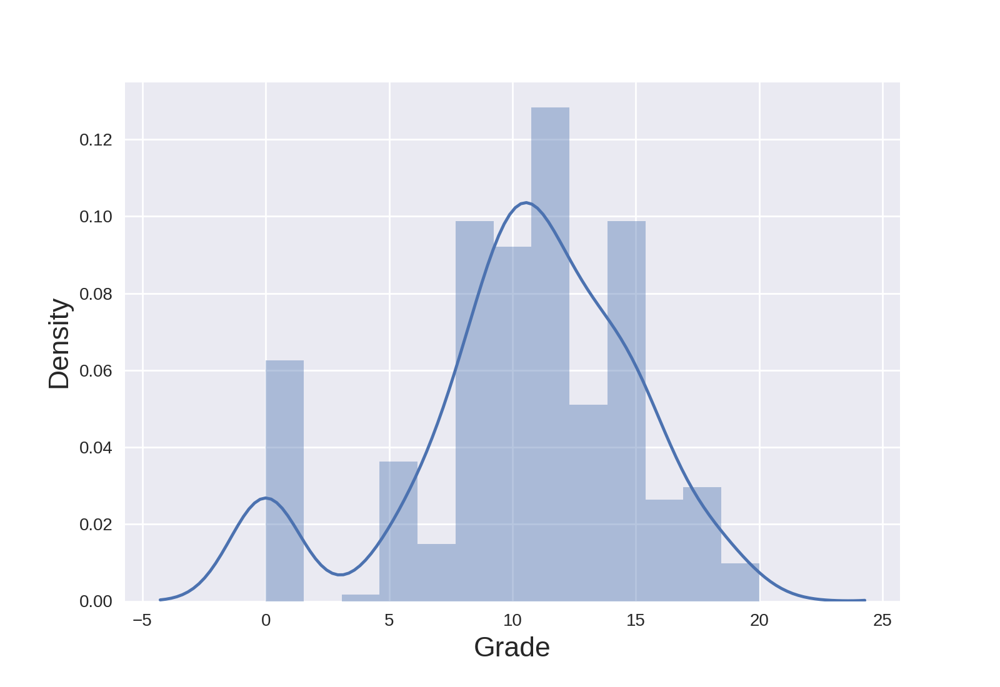
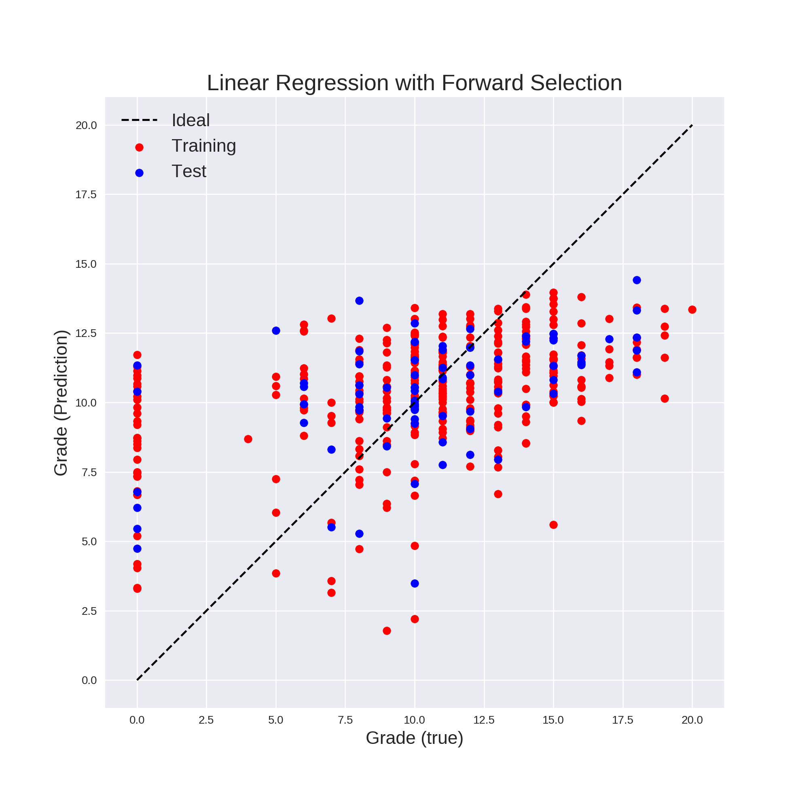
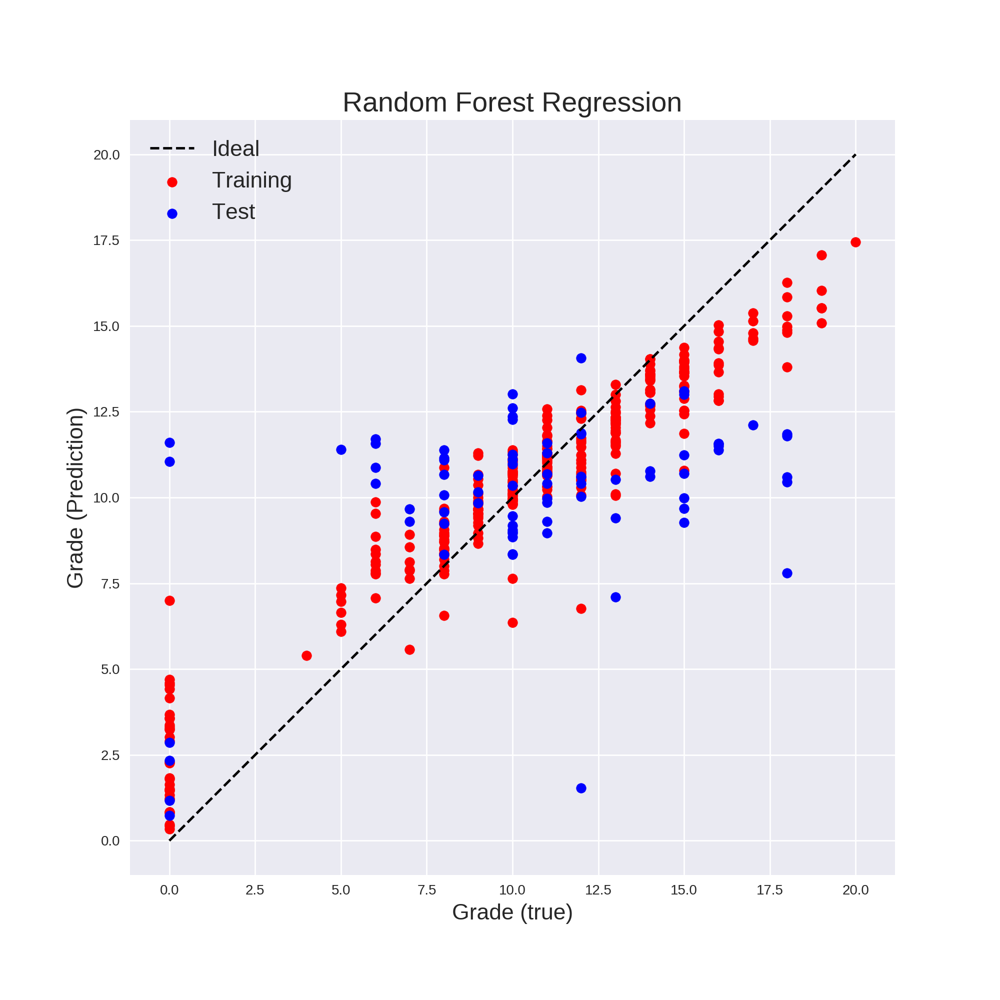
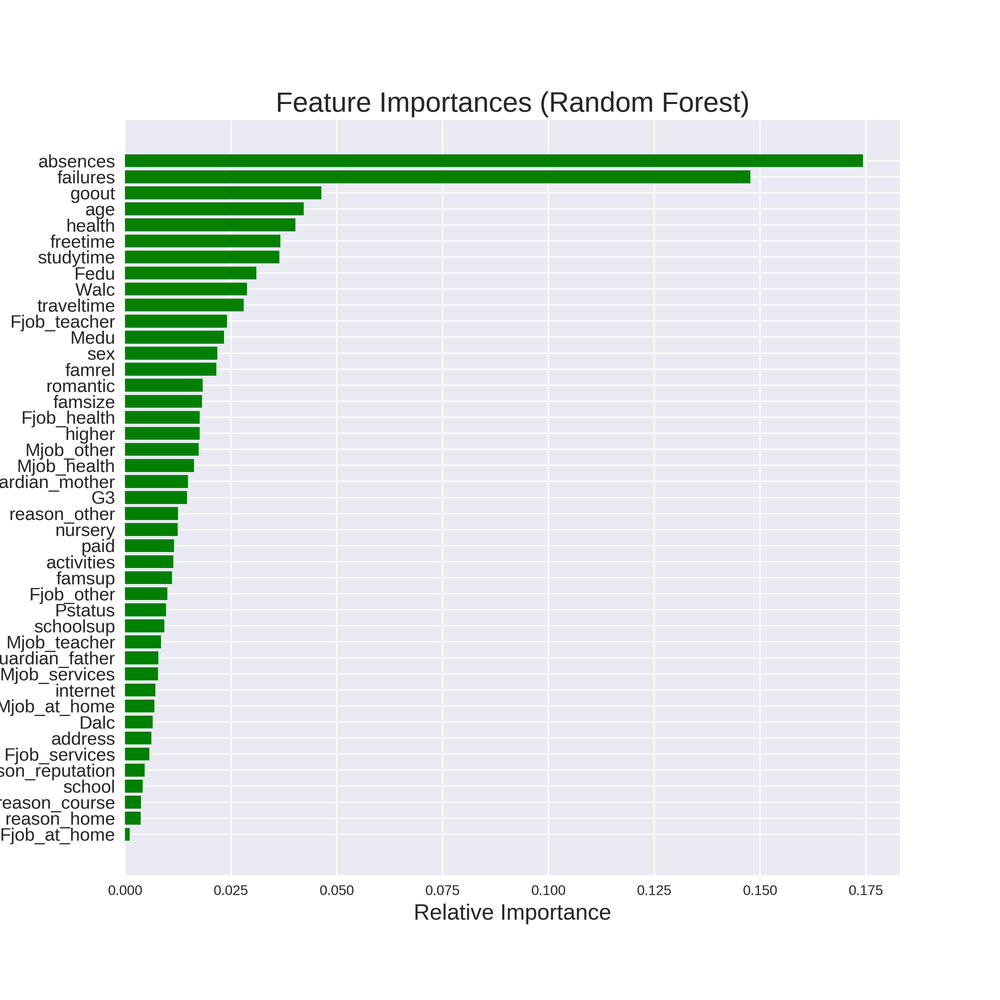

## Analysis of Student Performance Data Set

Education is a key factor in the development of social society. The study on improving education quality has never been stopped. Nowadays, with more structured data collected from students, a qualitative analysis using machine learning can give insights into the factors that have a strong influence on students' performance. Here in this report, we analyzed the _Student Performance Data Set[1]_ from [UCI](http://archive.ics.uci.edu/ml/datasets/Student+Performance) using a few supervised machine learning algorithms.

This data collect student achievement in secondary education of two Portuguese schools. The math and Portuguese exam grades are recorded as the measure of performance. In this report, we focus on the math data set.  There are 395 students has been surveyed on 30 school, demographic related features, such as gender, age, study time, etc. in this math dataset. We would like to use these features to build a model that can predict the performance of a new student. In addition, we also did feature selection to see the importance (correlation) of each feature on students' performance.

There are three grades recorded as `G1, G2, G3` in three exams. They are highly correlated as expected. Here we focus on the prediction on `G3`, the final grade in the range [0, 20]. The following is a distribution of the grades 

A detailed analysis, feature selection, and model selection can be found in this [notebook](https://github.com/ShunChi100/MachineLearningAnalysis_Student_Performance/blob/master/src/data_analysis.ipynb).

In the analysis, we tested four linear regression methods: `LinearRegressor()`, `Ridge()` (L2-regularization), `Lasso()` (L1-regularization), `ElasticNet()` (L1+L2-regularization), and two nonlinear regression methods: `RandomForestRegressor()` and `SVR()` (support vector machine). Data is split to train and test sets. Mean squared errors (MSE) on test dataset is used to characterize the models. Cross-validation is used to tune hyperparameters within the training data. Categorical data are converted to numerics using _One Hot Encoding_, resulting 43 features from 30 features.

`Lasso()` and `ElasticNet()` also selected features that possibly more relevant to students performance. `ElasticNet()` tends to select more features than `Lasso()`. In all the [features](http://archive.ics.uci.edu/ml/datasets/Student+Performance), their common selections are `[age, mother's education, study time, number of past class failures, go out with friends, number of school absences]`. Most of these features are intuitively make sense. However, neither `Lasso()` and `ElasticNet()` have the best MSE test errors. This is probably because the model missed some small correlations by deleting features.

In addition, we also performed feature selection using _Forward Selection_ method. It selected 20 out of 43 features. The first selected three features are `[number of past class failures, sex, mother's education]`, and two of them are consistent with the results from `Lasso()`. With these 20 selected features, a linear model is fitted to the data, the MSE test error reduces from 17.9 without feature selection to 14.1. That means feature selection does improve the accuracy of the linear regression model. The following is a plot of the true grades vs. predicted grades from the linear model fitted on the selected features

However, the lowest MSE test error is obtained from nonlinear random forest regressor. Its MSE test error is 13.6 without feature selection. If fitting random forest regressor with selected features from _Forward Selection_, the test error increases to 14.185. That means features selection actually does not help to the random forest regressor. The following is a plot of the predicted grades vs. true grades from the `RandomForestRegressor()` with optimal hyperparameters,

From the graph, it is a better fit than the linear regression model.

In addition, random forest outputs the importance of features, as shown below

We can see that the most important two features are `number of past class failures` and `number of school absences`. Both of these features are actually selected from forward selection, lasso, and elastic net. This is consistent with the previous study by Cortez et. al. [1].

In conclusion, we have performed feature and model selections. The random forest regressor model gives the best fit for this dataset. In addition, we found that the common selected two features `number of past class failures` and `number of school absences` are most influential on students' performance.

[1]P. Cortez and A. Silva. Using Data Mining to Predict Secondary School Student Performance. In A. Brito and J. Teixeira Eds., Proceedings of 5th FUture BUsiness TEChnology Conference (FUBUTEC 2008) pp. 5-12, Porto, Portugal, April, 2008, EUROSIS, ISBN 978-9077381-39-7.
